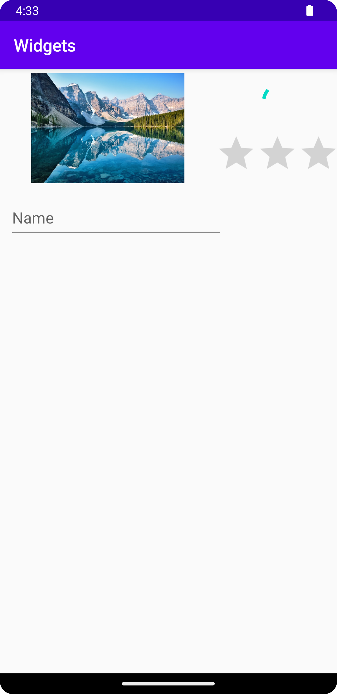

# Rapport
Ersatte den originella layouten "ConstraintLayout" på appen till vertical LinearLayout i filen "activity_main.xml". 

I filen "activity_main.xml" lades det till en horisontell LinearLayout i app layouten (vertical LinearLayout) med
de följande element: en ImageView, en vertical LinearLayout som innehåller elementen ProgressBar och RatingBar. 
Det lades till en "EditText" element i app layouten (vertical LinearLayout).

Koden för app layouten "vertical LinearLayout":
```
<?xml version="1.0" encoding="utf-8"?>
<androidx.appcompat.widget.LinearLayoutCompat xmlns:android="http://schemas.android.com/apk/res/android"
    xmlns:app="http://schemas.android.com/apk/res-auto"
    xmlns:tools="http://schemas.android.com/tools"
    android:layout_width="match_parent"
    android:layout_height="wrap_content"
    android:orientation="vertical"
    tools:context=".MainActivity">
```


